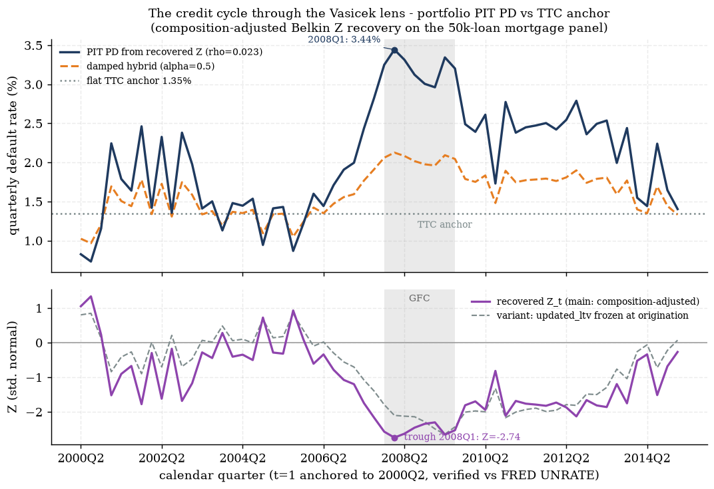
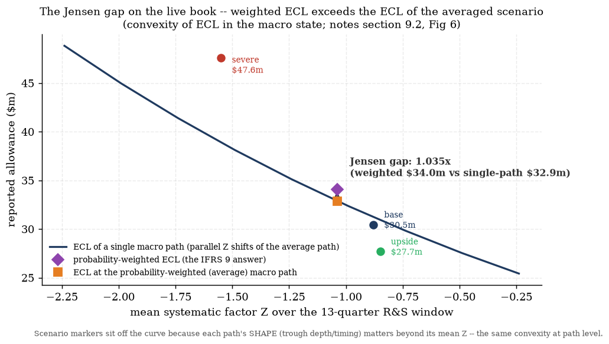
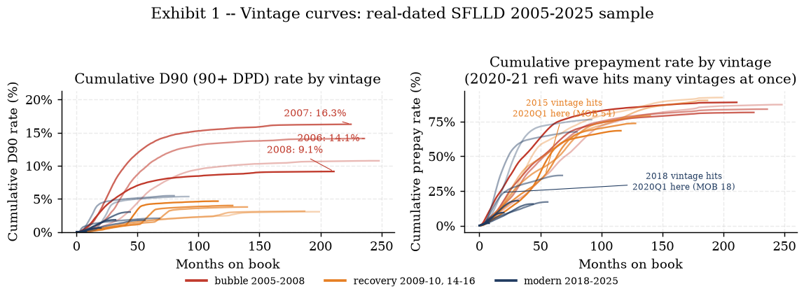
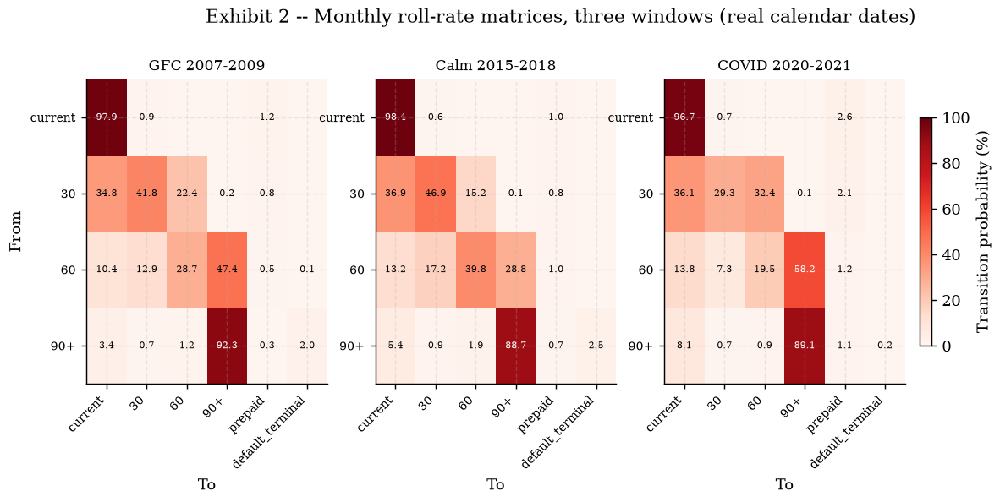
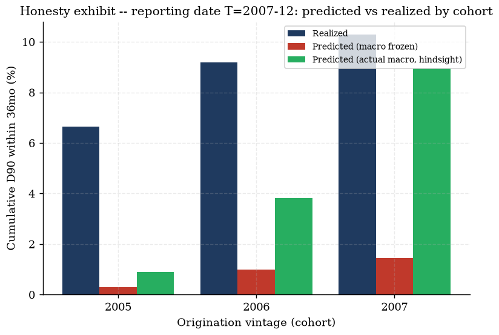
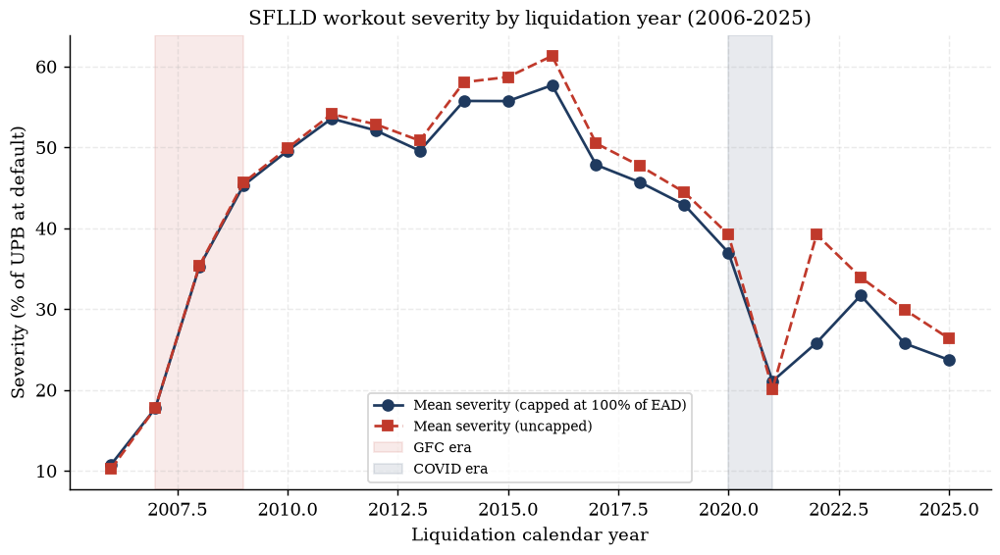
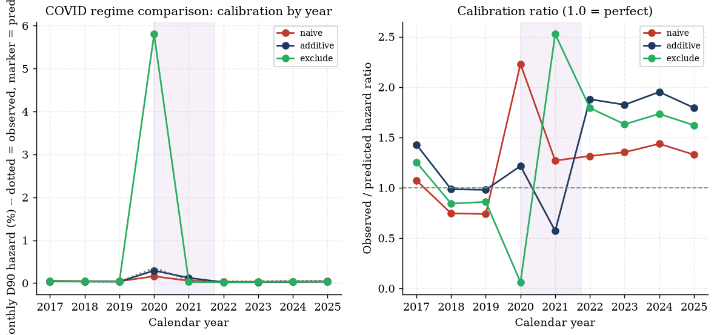
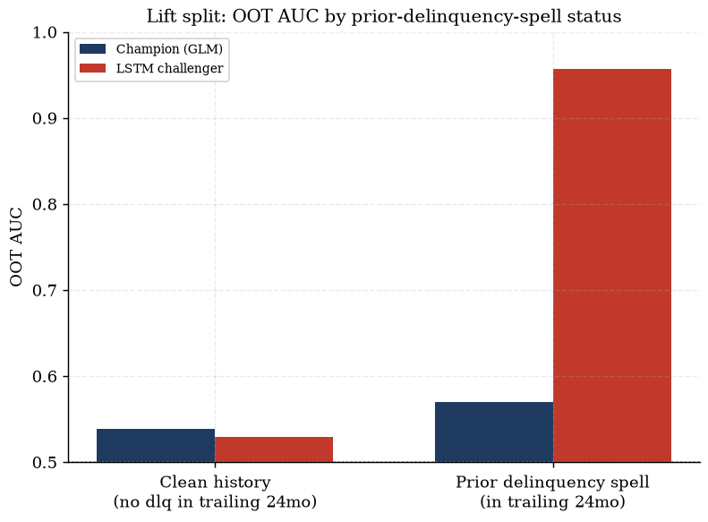

# Model Development Document — IFRS 9 Expected Credit Loss Engine & Agentic Copilot

**Document status:** formal MDD, compiled from the project wiki (`wiki/`) and the underlying model
output reports (`outputs/**`), which remain the systems of record. Every number in this document is
quoted **verbatim** from a cited source file — nothing here is recomputed. Where a source page or
report states a caveat, that caveat is carried into this document; nothing is smoothed over.

**Prepared:** 2026-07-19. **Scope:** DCR (CoreLogic-style synthetic) engine, rungs 1–2 (frozen,
production); Freddie Mac SFLLD (rung 3) hazard/LGD refit, ALFRED-vintage backtest, LSTM challenger
(Phase A + B, review-verified); Vasicek/Z scenario layer; LangGraph agentic interface.

---

## Contents

1. [Executive Summary](#1-executive-summary)
2. [Data](#2-data)
3. [Methodology](#3-methodology)
   3.1 [Hazard (PD) models](#31-hazard-pd-models)
   3.2 [LGD models](#32-lgd-models)
   3.3 [EAD](#33-ead)
   3.4 [Staging (SICR)](#34-staging-sicr)
   3.5 [ECL assembly](#35-ecl-assembly)
   3.6 [Vasicek/Z, satellite, scenarios](#36-vasicekz-satellite-scenarios)
   3.7 [Challengers (MLP, LSTM)](#37-challengers-mlp-lstm)
4. [Validation & Backtesting](#4-validation--backtesting)
5. [Limitations & Known Issues](#5-limitations--known-issues)
6. [Governance & Controls](#6-governance--controls)
7. [Appendix: Artifact Inventory & Exhibits](#7-appendix-artifact-inventory--exhibits)

---

## 1. Executive Summary

### 1.1 What this model is

A full IFRS 9 expected-credit-loss (ECL) stack, built in two generations sharing one frozen
computational core:

- **Engine (production, frozen 2026-07-05):** `engine/{hazard,lgd,ead,staging,ecl}.py` — a
  loan-quarter panel → discrete-time cloglog PD hazards (default + prepayment, competing risk) →
  two-stage cure×severity LGD → contractual EAD amortisation → relative-SICR staging → the ECL sum.
  Fit on the **DCR** panel (a CoreLogic-style national mortgage panel, anonymised calendar).
- **Scenario layer:** a Vasicek/Belkin single-factor systematic-risk model conditions the frozen PD
  hazard on a DFAST-shaped macro path via a satellite regression, producing probability-weighted
  scenario ECL.
- **Rung-3 stretch (Freddie Mac SFLLD, Phase A+B, 2026-07-17/18):** an independent, isolated refit of
  the hazard and LGD models on **real** Freddie Mac loan-level data (real dates, real states, real
  realised losses) — 837,500 loans / 39,522,565 loan-months across 17 sampled vintages — plus an
  ALFRED-vintage honest backtest and an LSTM path-dependence challenger. The frozen production
  engine is **never** touched by this stretch (isolation contract, §6.1).
- **Agentic layer:** a LangGraph three-tier copilot (compute / sandbox-analyze / cited-retrieval)
  fronting the frozen engine, deployed publicly on HF Spaces, with a refusal path and a labeled
  "REASONED" interpretation route for conceptual questions the engine cannot itself answer.

### 1.2 Headline results (verbatim, source-cited)

| Metric | Value | Source |
|---|---|---|
| DCR loan-quarter panel | 621,736 eligible rows / 49,974 loans, train t≤40 / OOT t=41–60 | `outputs/panel/waterfall.md` |
| DCR default hazard AUC | train 0.748 / OOT 0.661 | [[Hazard Model]] wiki page; `outputs/hazard/fit_stats.md` |
| DCR ECL gate | 187/187 tests; t=20 calm coverage 1.28% → t=40 stress coverage **28.4%** (22×) | [[ECL Engine]] wiki page |
| Vasicek ρ (calibrated) | **0.0227** (orig-LTV variant 0.0633), Z trough 2008Q1 (−2.74) | `outputs/vasicek/vasicek_report.md` |
| Scenario ECL / Jensen gap | weighted **$34.0m** vs $32.9m at the averaged path = **1.035×** | `outputs/scenario_ecl/scenario_ecl_report.md` |
| SFLLD panel | **837,500 loans / 39,522,565 loan-months**, 17 vintages | `wiki/pages/sflld-panel.md` |
| SFLLD champion hazard AUC | train **0.8536** / OOT **0.6847** (DCR: 0.748/0.661) | `outputs/freddie/hazard/hazard_report.md` |
| COVID regime verdict | **EXCLUDE** window 2020-04..2021-09 for structural/scenario use (review overturned the author's additive-dummy recommendation) | `outputs/freddie/hazard/hazard_report.md` §3 |
| SFLLD realised-loss LGD | mean realised LGD (train) **0.2715**; excess-loss loading **0.0148** vs DCR's **0.0255** | `outputs/freddie/lgd/lgd_report.md` |
| SFLLD cure AUC | train 0.6991 / **OOT 0.4769** (honest-weak, below random — explained, not hidden) | `outputs/freddie/lgd/lgd_report.md` §4 |
| ALFRED-vintage backtest, 2007-12 | frozen-macro model **underpredicted** realised 36mo cum-D90 by **9.42×** (0.928% vs 8.750%); hindsight-macro ceiling still **1.90×** under | `outputs/freddie/backtest/backtest_report.md` |
| ALFRED-vintage backtest, 2019-12 | hindsight-macro projection **saturates**: 71.519% predicted vs 4.601% realised = **0.06×** | `outputs/freddie/backtest/backtest_report.md` |
| LSTM challenger | OOT AUC **0.9925** vs champion 0.6847; lift concentrated on prior-delinquency-spell loans (**0.957** vs 0.570) — near-random on clean history (0.529 vs 0.539) | `outputs/freddie/lstm/lstm_report.md` |
| Test-suite gate history | 187 → 381 → 509 → 553 → 582 → **659/659** (current), zero regressions | `wiki/memory/log.md`; `outputs/freddie/gate_phaseB.md` |

### 1.3 Governance verdicts, at a glance

| Component | Review verdict | Source |
|---|---|---|
| ECL engine (`engine/ecl.py`) | **Clean** | `wiki/pages/ecl-engine.md` |
| EAD (`engine/ead.py`) | Fixed (edge-case guard only) | `wiki/pages/ead-model.md` |
| Staging (`engine/staging.py`) | Fixed (config plumbing bug + docstring overclaim) | `wiki/pages/staging-model.md` |
| LGD (`engine/lgd.py`) | Fixed (documentation only) | `wiki/pages/lgd-model.md` |
| Vasicek / scenarios / satellite / challenger | Clean / Clean / **Fixed** (report-integrity) / Clean | `wiki/pages/scenario-layer.md` |
| Agent layer | Fixed (SSE deadlock test + NaN-422 edge) | `wiki/pages/agent-layer.md` |
| SFLLD hazard COVID recommendation | **Overturned on review** (additive dummy → exclude) | `outputs/freddie/hazard/hazard_report.md` §3 |
| SFLLD backtest realised-outcome timing | **Critical bug found and fixed** (disposition month → first-D90 month) | `wiki/memory/decisions.md`, 2026-07-18 entry |
| Phase-B gate | **PASS**, 659/659, frozen five NONE, DCR panel byte-identical | `outputs/freddie/gate_phaseB.md` |

### 1.4 North star (binding on every design decision)

The product is a **consultant's deliverable + client's lab**: the consultant (this build) pre-generates
the full analysis; the client browses it, runs scenario experiments, and an LLM agent gives grounded
interpretation — **never hallucinated numbers** (Tier-1/2 compute deterministically, Tier-3 cites
sources, the narrator is verbatim-number-checked, refusal/REASONED governance stays intact).
(`wiki/memory/decisions.md`, 2026-07-08 entry.)

---

## 2. Data

### 2.1 DCR panel — calendar anchoring 2000Q2–2015Q1

`data/panel/build_panel.py` builds `data/processed/panel.parquet` from 622,489 raw DCR loan-quarter
rows (50,000 loans). The eligibility waterfall (`outputs/panel/waterfall.md`) is fully itemised over
7 steps — every dropped row is accounted for, every lost default/payoff event is counted:

| # | Step | Rows dropped | Reason (abridged) |
|---|---|---:|---|
| 1 | exact_duplicate_rows | 305 | verbatim duplicate rows (incl. doubled terminal rows on 3 loan ids) |
| 2 | id_collision_loans | 108 | 5 ids each contain two interleaved distinct loans |
| 3 | same_quarter_status_conflict | 7 | status-0 row shadowing a terminal row, same (id,time) |
| 4 | post_terminal_truncation | 0 | generic guard, recorded to prove it ran |
| 5 | nonpositive_origination_balance_loans | 270 | 18 loans, `balance_orig_time` missing-coded 0 |
| 6 | zero_balance_live_rows | 38 | non-terminal rows with balance ≤ 0 (missing-coded) |
| 7 | nonpositive_current_note_rate_rows | 25 | note rate missing-coded 0 → prepay incentive incomputable |

**Final panel:** 621,736 rows / 49,974 loans / 15,147 defaults / 26,580 payoffs (8,247 loans
right-censored); **train** = t≤40 (421,761 rows, 11,420 defaults); **OOT** = t=41–60 (199,975 rows,
3,727 defaults) — OOT is the stress window by construction (`wiki/pages/loan-panel.md`).

**Calendar anchoring (`wiki/memory/log.md`, 2026-07-05 17:26 entry):** the panel's `uer_time` column
matches FRED UNRATE quarterly at correlation 0.9963 / RMSE 0.15pp at exactly one offset ⇒ **t=1 ≈
2000Q2, t=60 ≈ 2015Q1**. Cross-checks: UER peak t=39 ≈ 2009Q4 (US peak 10.0%), HPI peak t=25 ≈ 2006Q2,
trough t=48 ≈ 2012Q1 (−35.3% drawdown). Macro columns are genuine US **national** series on an
anonymised loan clock; there is no true 2026 snapshot — the panel ends ~2015Q1, so Day-3 scenarios are
applied as deltas from the 2015Q1 jump-off (documented framing).

Flags kept, not dropped: `orig_rate_missing` (89,730 rows across 10,713 loans, 21.4% of loans), 2,829 missing-state
rows (`state_orig_time_missing` — state unused at this rung; the rung-3 upgrade closes exactly this
gap), 3,343 lag warm-up rows (time≤5). Updated LTV = `LTV_orig × (bal_t/bal_orig) × (hpi_orig/hpi_t)`,
independently derived and verified equal to the vendor's `LTV_time` field to 5e-9. Macro lags
(`uer_lag1/2`, `uer_chg4_lag1`, `gdp_lag1`, `hpi_growth_lag1`) built with a groupby-shift, agreement
asserted to 1e-9, zero lookahead. `lgd_time` populated iff a default row (15,147); 9.8% of realised
LGDs exceed 1 (max 8.52) — kept raw for the LGD model to handle explicitly, never clipped upstream.

### 2.2 SFLLD panel (rung 3) — real dates, states, losses

Source: Freddie Mac Single-Family Loan-Level Dataset, **17 sample vintages** (2005–2010, 2014–2016,
2018–2025; **2011–2013 and 2017 were never downloaded — a documented coverage gap**), ingested by
`freddie/ingest.py` + `freddie/build_panel.py`, macro merged by `freddie/macro.py`
(`wiki/pages/sflld-panel.md`; `outputs/freddie/eda/eda_report.md`).

- **837,500 loans; 39,522,565 modelled loan-months.**
- **Default = D90 absorbing**: first 90+DPD or straight-to-RA; the panel truncates after the event
  month even if the raw servicing tape later shows a cure (unit-tested on a real curing loan).
  Same-row D90/terminal-code tie-break: disposition code wins (~0.1–0.2% of loans).
- Liquidation codes + realised-loss fields are kept on `loan_orig.parquet` from the **un-truncated**
  tape, for competing-risk / LGD use. Sentinels (9999/999/99/`'9'`) → NaN, each documented.
- Loan-level rates: D90 5.32%, prepay 58.93%.
- **State macro:** FRED per state — `{POSTAL}UR` monthly + `{POSTAL}STHPI` quarterly
  (all-transactions), 54 states/territories; national fallback for GU/VI (UR) and GU/PR/VI (HPI),
  documented. 108 cached CSVs enable offline reruns. No-lookahead quarterly→monthly HPI fill;
  lag-1 columns mirror the DCR timing convention.
- **Isolation:** the entire rung-3 build lives in the `freddie/` namespace, writes only to
  `outputs/freddie/` / `data/processed/freddie/`, and the Phase-A gate verified the frozen engine
  files and `data/processed/panel.parquet` (DCR) untouched, sha-recorded (`wiki/pages/sflld-panel.md`).

**Real geography, real cycle — what SFLLD buys over DCR** (`outputs/freddie/eda/eda_report.md`):
2007-vintage cumulative D90 reaches **16.26%** by month 225 on book (vs 14.11% for 2006, 9.14% for
2008; every recovery/modern vintage tops out below 5.48%). State heterogeneity on 2006–07 vintages:
NV 38.0% / FL 32.6% / AZ 27.9% vs VT 4.8% — a collateral-channel scatter (peak-to-trough HPI drawdown
vs default rate) fitting slope 0.491, r=0.89, p=2e-17 across 49 states, invisible to a national-only
panel.

**The COVID data anomaly (central EDA finding, quantified in roll rates):** during 2020–2021, the
60→90+ DPD roll rate is **58.25%**, *worse* than the GFC's 47.43%, because the delinquency-status
ladder kept advancing contractually for loans in forbearance — while 90+→liquidation **collapses to
0.21%**, versus 2.02% in the GFC and 2.50% in the calm 2015–2018 window (a >10× drop — the CARES Act
foreclosure-moratorium signature). 75.9% of COVID 60/90+ loans carry an active
`borrower_assistance_status_code`, versus 15.6% in the calm window. The combined-vintage D90-entry
rate's global peak is the **COVID spike** (1.775% in 2020-06, ~4.5× the GFC's own peak of 0.396% in
2009-10) — a naive delinquency-based read would call COVID the bigger credit event; it was not a loss
event. This single finding drives the Phase-B COVID-regime decision (§3.1.3).

### 2.3 Macro sources

- **DCR national macro:** embedded in the vendor panel (`uer_time`, `gdp_time`, `hpi_time`),
  anonymised-clock but calendar-anchored as above.
- **DFAST 2026 scenario paths:** Fed Final Historic / Baseline / Severely-Adverse Domestic CSVs,
  auto-downloaded (`data/scenarios/`); severe path preserves +5.5pp UER exactly, rebased as deltas
  onto the 2015Q1 jump-off, reversion to long-run means by quarter 21, 40-quarter horizon.
- **SFLLD state macro:** FRED (see §2.2); **ALFRED** vintages are used for the honest backtest (§4.3)
  — but FHFA STHPI (state *and* national) has **no ALFRED vintage archive on FRED at all** (empirically
  verified: HTTP 400 "does not exist in ALFRED" for every `realtime_start` tried), so HPI-as-known-at-T
  is a publication-lag truncation (`HPI_PUBLICATION_LAG_MONTHS=5`) of the single current-vintage
  series, not a genuine historical revision — declared, not hidden
  (`outputs/freddie/backtest/backtest_report.md` §4–5).
- **State-level upgrade path:** the DCR engine's macro is national-only by scope
  (`state_orig_time` unused at that rung); rung-3's state-level FRED merge is exactly the closing of
  that gap (`wiki/pages/sflld-panel.md`).

---

## 3. Methodology

### 3.1 Hazard (PD) models

#### 3.1.1 DCR champion hazard (`engine/hazard.py`)

Discrete-time **complementary log-log (cloglog)** hazard — the grouped-duration analogue of a
continuous-time Cox model — fit as cause-specific competing risks (default, prepayment):

$$\lambda_t = 1 - \exp\!\big(-\exp(x_t^\top \beta)\big)$$

with cumulative/marginal survival built from the per-quarter hazards: conditional hazard
$\lambda_t$, competing-risk survival $S(t)$, marginal event probability $S(t-1)\lambda_t$, cumulative
PD via `pd_term_structure`. API: `fit_default_hazard(panel)`, `fit_prepay_hazard(panel)`,
`predict_hazard(model, df)`, `pd_term_structure(models, profiles, horizon)`.

**Fit (train t≤40; `outputs/hazard/fit_stats.md`, `outputs/hazard/hazard_ratios.md`):**

| Model | n (fit) | events | train AUC | OOT AUC | McFadden R² |
|---|---:|---:|---:|---:|---:|
| default | 418,418 | 11,354 | 0.7476 | 0.6609 | 0.0761 |
| prepay | 418,418 | 22,734 | 0.6839 | 0.5841 | 0.0503 |

(Wiki summary quotes the rounded 0.748/0.661 and 0.684/0.584 — same fit, display rounding.)

**Coefficient table (default hazard, hazard ratios, `outputs/hazard/hazard_ratios.md`):**

| Covariate | family | HR = exp(coef) | 95% CI | p |
|---|---|---:|---|---|
| Intercept | baseline | 0.2658 | [0.1534, 0.4608] | 2.35e-06 |
| FICO at orig. (per 100 pts) | borrower | 0.6314 | [0.6130, 0.6505] | <1e-16 |
| Updated LTV (per 10pp, at mean UER) | collateral | 1.2250 | [1.2100, 1.2402] | <1e-16 |
| Rate incentive (pp) | incentive | 1.1424 | [1.1317, 1.1532] | <1e-16 |
| Investor loan | borrower | 1.2091 | [1.1425, 1.2796] | 5.05e-11 |
| Condo | borrower | 1.0649 | [0.9793, 1.1580] | 1.41e-01 |
| Planned urban dev. | borrower | 1.0852 | [1.0129, 1.1626] | 2.01e-02 |
| Single family | borrower | 0.9909 | [0.9433, 1.0408] | 7.15e-01 |
| Unemployment level (lag 1) | macro | 0.6930 | [0.6544, 0.7338] | <1e-16 |
| Unemployment 4q change (lag 1) | macro | 1.8468 | [1.6989, 2.0077] | <1e-16 |
| HPI growth (lag 1) | macro | 0.0318 | [0.0148, 0.0683] | <1e-16 |
| GDP growth (lag 1) | macro | 1.0895 | [1.0645, 1.1151] | 4.47e-13 |
| LTV(10pp) × UER (double trigger, centered) | collateral | 0.9940 | [0.9885, 0.9997] | 3.75e-02 |

**Per-variable rationale (`outputs/variable_dictionary.md`, `wiki/pages/variable-dictionary.md`):**

| Variable | Transform | Timing | Rationale | Expected sign | Fitted |
|---|---|---|---|---|---|
| `fico_s` | `FICO_orig_time`/100 | static (origination) | ability/willingness to pay | PD ↓ | ✓ negative |
| `ltv10` ⚡ | `updated_ltv`/10, winsor 300 | **current-quarter state** (collateral indexation exception) | equity cushion / strategic-default trigger | PD ↑ | ✓ +0.2029/10pp at mean UER |
| `loan_age` | natural cubic spline `cr(age, df=5)` | per-quarter | seasoning: underwriting burn-in → peak risk → survivor selection | hump | ✓ fitted peak 12q vs empirical 10q |
| `prepay_incentive` ⚡ | note rate − market rate | **current-quarter state** (real-time option value) | refinancing incentive | prepay ↑ | ✓ Spearman +0.95 |
| `investor_orig_time` | raw flag | static | strategic-default propensity | PD ↑ | ✓ |
| `uer_lag1` | national UER level | lag 1q | cash-flow shock channel | net ↑ | ✓ NET effect, see below |
| `uer_chg4_lag1` | 4q UER change | lag 1q | labour-market momentum | ↑ | ✓ |
| `hpi_growth_lag1` | Δlog national HPI | lag 1q | collateral macro channel | PD ↓ | ✓ |
| `gdp_lag1` | GDP growth | lag 1q | activity channel | PD ↓ | ✓ |
| `dt_ltv_uer` | centered LTV × centered UER | mixed | double trigger | ↑ | −0.006 (p=.04), in-sample substitution — disclosed, see §5 |

**TIMING CONVENTION (review-enforced):** every macro *regressor* is lagged. Two deliberate
**current-quarter** state variables are the flagged exceptions: `updated_ltv` (collateral
indexation by current HPI) and `prepay_incentive` (real-time market rate — lagging it would misprice
the option). Documented in the module docstring; any future covariate must follow the same rule.

**Reading the unemployment coefficient — the net-effect convention (`outputs/hazard/fit_stats.md`):**
a 1pp labour-market shock moves the level AND its 4-quarter change together (they correlate 0.94
in-sample), so the correct hazard effect at mean LTV is the **sum** of the two coefficients:
$\beta(\text{uer\_lag1}) + \beta(\text{uer\_chg4\_lag1}) = -0.3668 + 0.6135 = +0.2467$ (hazard ratio
**1.280** per pp) — PD *rises* in unemployment. Reading the level coefficient alone (negative) as "PD
falls in unemployment" is a documented misread this MDD explicitly guards against; always quote the
net effect.

**Double trigger:** LTV×UER interaction coefficient is **−0.006** (p=.04) — a slight in-sample
substitution effect (the LTV slope flattens marginally at high unemployment; main effects + momentum
already carry the joint stress response). Reported honestly, not asserted as the textbook-positive
sign; interview-story framing lives in `outputs/hazard/fit_stats.md`.

**EDA verification** (`outputs/eda/`, 5 PASS / 0 FAIL / 1 INFO): seasoning hump peak age 10 (empirical);
worst vintages = HPI-peak cohorts (48.8% = 2.4× median default rate); prepay monotone in incentive;
LGD bimodal (20.6% exact cures). A roll-rate/cure chart is impossible at the DCR rung — no delinquency
ladder — deferred to Freddie rung 3.

#### 3.1.2 SFLLD champion hazard — the rung-3 refit

`freddie/fit_hazard.py`: a fresh monthly discrete-time cloglog D90 hazard on the SFLLD loan-month
panel, state-level macro, **no left truncation** (sampled from origination — an upgrade over DCR).
Only the DEFAULT (D90) cause-specific hazard is fit — **no competing-risk prepayment hazard** in this
refit (declared simplification).

**Sample & split** (`outputs/freddie/hazard/hazard_report.md` §1): champion train = performance month
≤ 2016-12 (17,703,723 loan-months, 26,284 D90 events, 0.1485% monthly hazard); OOT = performance month
≥ 2017-01 (21,818,842 loan-months, 18,309 events); COVID (2020-04..2021-09) lands entirely inside OOT.
Fit sample uses **WESML** (weighted exogenous sampling maximum likelihood, Manski-Lerman): every train
event row enters (26,284), plus a 5% random subsample of non-event rows, 83,680 NaN-covariate rows
dropped → 826,476 fit rows / 24,611 events; controls reweighted `freq_weight = 1/rate`, events
`freq_weight = 1`.

**Coefficients vs the DCR champion** (`outputs/freddie/hazard/coefficients.csv`, `dcr_sign_comparison.csv`):

| term | coef | hazard ratio | p-value | sign | DCR expected sign |
|---|---:|---:|---:|:---:|---|
| Intercept | −3.6043 | 0.027 | 0 | − | |
| occupancy[T.I] (investor) | 0.0943 | 1.099 | 4.69e-04 | + | |
| occupancy[T.S] (second home) | −0.1926 | 0.825 | 8.18e-09 | − | prior + (miss, explained below) |
| loan_purpose[T.C] (cash-out) | 0.4379 | 1.550 | 4.02e-184 | + | + |
| loan_purpose[T.N] (no-cash refi) | 0.2704 | 1.310 | 1.69e-50 | + | prior − (miss, explained below) |
| channel[T.B] (broker) | 0.1986 | 1.220 | 6.34e-09 | + | + |
| channel[T.C] (correspondent) | −0.2341 | 0.791 | 4.96e-14 | − | prior + (miss, explained below) |
| channel[T.T] (TPO) | 0.3072 | 1.360 | 8.06e-109 | + | + |
| `cr(loan_age, df=5)` (5 basis terms) | −1.92 / −0.34 / −0.59 / +0.04 / −0.80 | — | — | hump | hump, ~36mo peak |
| `fico_s` | −0.9257 | 0.396 | 0 | − | − |
| `dti_s` | 0.2313 | 1.260 | 0 | + | n/a — no DTI field at DCR rung |
| `ltv10` | 0.3225 | 1.381 | 0 | + | + |
| `uer_lag1` | 0.0950 | 1.100 | 1.42e-208 | + | + (net) |
| `delta_uer_lag1` | 0.6671 | 1.949 | 2.97e-194 | + | + |
| `hpi_growth_lag1` | −3.3442 | 0.035 | 2.1e-12 | − | − |

**Fitted signs vs priors — misses stated, not hidden:** `occupancy[T.S]` fitted −0.193 against a prior
of +; `loan_purpose[T.N]` fitted +0.270 against a prior of −; `channel[T.C]` fitted −0.234 against a
prior of +. All three are **conditional** effects (given FICO/DTI/updated-LTV/macro), so a flipped
categorical sign reads as *composition within this sample*, not a causal claim — e.g. second-home
borrowers clearing the same FICO/LTV bar as owner-occupants default less here, and correspondent loans
in this Freddie sample are not the pre-crisis wholesale book the prior describes. The core risk drivers
(FICO −, DTI +, updated LTV +, UER +, ΔUER +, HPI growth −) all match their priors
(`outputs/freddie/hazard/hazard_report.md` §2).

**Discrimination & seasoning:** champion train AUC **0.8536**, OOT AUC **0.6847**, McFadden pseudo-R²
(fit sample) **0.1197**. Empirical train-window hazard-by-age profile: single hump peaking in the
42–48-month bin (0.256% monthly), corroborating the DCR champion's ~12-quarter (~36-month) peak. The
*fitted* reference-row curve shows an additional, higher peak near 108 months that the raw profile does
not — train rows with age ≥ 96 months come exclusively from the 2005–2008 crisis vintages (later
vintages are too young by 2016-12), so the late-age rise is unobserved **cohort quality**, not a
seasoning effect; extrapolation beyond ~143 months has no train support (§3.1.4 of the report).

#### 3.1.3 COVID regime handling — the review overturn

The champion fit (train ≤2016-12) never sees COVID rows by construction. To test regime treatments,
the estimation window is extended to ≤2021-09 and three variants are fit, all scored on the *identical,
genuinely unseen* OOT2 window (>2021-09):

| variant | OOT2 AUC | `delta_uer_lag1` | `hpi_growth_lag1` |
|---|---:|---:|---:|
| naive (no dummy) | 0.7553 | **−0.204** (sign-flipped vs champion +0.667) | +0.013 (collapsed) |
| additive (regime dummy) | 0.7547 | **−0.130** (still sign-flipped) | −6.584 (overshoots) |
| **exclude** (COVID rows removed from likelihood) | 0.7509 | **+0.774** (matches champion +0.667) | −3.307 (matches champion −3.344) |

The additive dummy itself fits **+1.482** (hazard ratio 4.40) — it absorbs the 2020 D90 spike, but it
**does not repair the structural macro block**: `delta_uer_lag1` stays sign-flipped. A calendar-level
dummy cannot undo a joint covariate-outcome distortion when the UER spike and the forbearance-shielded
delinquency ladder co-move inside the same window.

**Decision, per the record (`wiki/memory/decisions.md`, 2026-07-18 20:47 entry):** the author's initial
recommendation was the additive dummy; the **Fable adversarial review overturned it**, showing the
report's own numbers contradicted the recommendation, and rewrote the verdict number-first: **EXCLUDE**
the window 2020-04..2021-09 for any structural or scenario-conditional use — it is the only variant
whose macro block survives economically signed. Forbearance is to be handled as a scoring overlay, not
an in-likelihood dummy. The OOT2 AUC spread (0.7509–0.7553) is too small to override the structural
argument.

**Residual caveat, all variants:** 2022–2025 observed hazard runs ~1.62–1.79× the exclude-variant
predictions — a post-COVID level shift for a backtest/ECL-overlay stage, not fixed by the regime
treatment itself.

#### 3.1.4 WESML inference caveat

Refit on an independent control-sample seed (1234 vs 42): **0 sign flips**; max relative coefficient
difference 0.486 on a near-zero spline term. Macro-term absolute swings between seeds:
`delta_uer_lag1` 0.128 vs nominal SE 0.0224 (**~5.7× nominal SE**); `hpi_growth_lag1` 0.830 vs nominal
SE 0.4759 (~1.7×). This is the expected WESML caveat: `freq_weights` scales the 5% control subsample
back to population size, so the reported SEs/p-values approximate a full-population fit and exclude the
Monte-Carlo noise of *which* controls were sampled (Manski-Lerman point estimates are consistent; their
asymptotic variance needs a sandwich estimator this exhibit does not report). **`seed_stability.csv` —
not the nominal p-values — is the operative uncertainty statement for macro terms**
(`outputs/freddie/hazard/hazard_report.md` §5).

### 3.2 LGD models

#### 3.2.1 DCR champion LGD (`engine/lgd.py`)

Two-stage workout LGD (notes §10): **cure logit × fractional-logit severity** (Papke–Wooldridge), fit
on **9,496 resolved train defaults** (11,420 train defaults − 1,921 unresolved workouts − 3 NaN rows):

$$E[\text{LGD}] = (1 - P(\text{cure})) \times (\text{capped severity} + \text{excess loading})$$

**Key conventions:**
- **Resolved workouts only** — unresolved `lgd_time` is not a realised outcome (58% coded 0);
  selection bias documented (cures resolve faster, biasing fitted cure up near the window end).
- **Excess-loss loading:** 14.2% of train non-cure LGDs exceed 1 (max 3.17, real workout costs); capped
  at 1 inside the link, truncated-mean mass **+0.0255** added back explicitly — **never clipped**. OOT
  realised excess 0.0236 validates the loading.
- Cure = LGD ≤ 0.05 (labelling convention; the cure/severity decomposition is near-invariant at
  0.0/0.05/0.10).
- **Honest anomaly:** cure-stage `uer_lag1` is **positive** (+0.277) — conditional on updated LTV,
  stress-cohort defaulters cure *more*; robust in a fixed-runway subsample; disclosed, not asserted.

**Fit quality:** cure AUC 0.837 train / 0.769 OOT. Calibration: train gap −0.0005; OOT +0.047
(conservative, within the 0.05 tolerance; decomposed in `outputs/lgd/lgd_report.md`). Fitted signs:
cure ↓LTV (−0.764), severity ↑LTV (+0.107) — the collateral channel.

#### 3.2.2 SFLLD realised-loss LGD — the rung-3 refit

`freddie/lgd.py` reconstructs realised loss from Freddie's own cash-component fields
(`net_sale_proceeds`, `mi_recoveries`, `non_mi_recoveries`, `total_expenses`,
`delinquent_accrued_interest`, `zero_balance_removal_upb`) — **not** an opaque vendor column like DCR's
`lgd_time` — and locks the sign convention with a fixture loan traced from the raw servicing tape. Sign
convention: `realized_loss = -actual_loss_calculation`, verified reconciling to sub-dollar rounding
(`outputs/freddie/lgd/lgd_report.md` §1).

**Sample & outcome partition** (44,593 `had_d90_event` loans, exhaustive/disjoint partition):

| lgd_outcome | OOT | train | total |
|---|---:|---:|---:|
| cure | 14,141 | 12,429 | 26,570 |
| liquidation | 430 | 14,480 | 14,910 |
| unresolved | 1,885 | 1,228 | 3,113 |

Zero-balance code 15 (whole-loan sale) is **split, not lumped whole into unresolved**: 853 of 922
code-15 D90 rows carry a populated `actual_loss_calculation` (92.5%) and are counted as liquidation
(Freddie's NPL-sale program); only the remaining 69 no-loss-field rows stay unresolved.

**Severity denominator:** `upb_at_default` (not `zero_balance_removal_upb`) — the theoretically correct
EAD base, observable *at* default rather than years later at resolution. Reconciliation on 13,840
liquidation rows: correlation 0.9948, mean ratio 1.0018 (essentially the same number).

**Stage 1 — cure logit** (`cure ~ ltv10 + fico_s + loan_age_at_default + C(era) + C(property_state)`,
train resolved n=26,896):

| term | coef | std_err | p_value |
|---|---:|---:|---:|
| Intercept | 4.2819 | 0.4589 | 0.0000 |
| `era[recovery 2009-10,14-16]` | 0.8034 | 0.0406 | 0.0000 |
| `era[modern 2018-2025]` | 0.1498 | 0.7062 | 0.8320 (unidentified — see §5) |
| `ltv10` | −0.2475 | 0.0075 | 0.0000 |
| `fico_s` | −0.3643 | 0.0243 | 0.0000 |
| `loan_age_at_default` | 0.0066 | 0.0005 | 0.0000 |
| (53 `property_state` fixed effects) | see full table | | |

Cure AUC: train **0.6991**, OOT **0.4769**.

**Stage 2 — severity | liquidation** (fractional logit, HC1 robust SEs;
`sev_capped ~ ltv10 + C(liq_year_bucket) + is_judicial + C(disposition_type)`, train liquidations
n=13,444):

| term | coef | std_err | p_value |
|---|---:|---:|---:|
| Intercept | −1.8372 | 0.1809 | 0.0000 |
| `liq_year_bucket[2008-09 crash]` | 1.3517 | 0.1803 | 0.0000 |
| `liq_year_bucket[2010-12 peak workout]` | 1.7275 | 0.1775 | 0.0000 |
| `liq_year_bucket[2013-16 recovery]` | 1.6983 | 0.1778 | 0.0000 |
| `liq_year_bucket[2017-19 calm]` | 1.3792 | 0.1816 | 0.0000 |
| `liq_year_bucket[2020+ covid-modern]` | 0.8751 | 0.1927 | 0.0000 |
| `is_judicial[True]` | 0.5199 | 0.0207 | 0.0000 |
| `disposition_type[short_sale_or_charge_off]` | −0.7200 | 0.0236 | 0.0000 |
| `disposition_type[third_party_sale]` | −0.3982 | 0.0290 | 0.0000 |
| `disposition_type[whole_loan_sale]` | −0.3477 | 0.0471 | 0.0000 |
| `ltv10` | 0.0307 | 0.0049 | 0.0000 |

**Per-variable rationale (both stages):**

| variable | economic rationale | expected direction |
|---|---|---|
| `ltv10` (cure) | equity cushion lets a distressed borrower sell/refi out of default | − |
| `ltv10` (severity) | less equity → bigger foreclosure shortfall | + |
| `fico_s` | ability/willingness to work a resolution | + (weak) |
| `loan_age_at_default` | seasoned defaulters cure less (burnout) | − |
| `era` | underwriting-quality + macro-regime cohort effect | era-dependent |
| `property_state` | regional foreclosure-process / servicing heterogeneity | state-dependent |
| `liq_year_bucket` | workout costs + distressed-sale discounts vary with the disposition-year cycle | hump, peak 2010–12 |
| `is_judicial` | judicial process is slower/costlier | + |
| `disposition_type` | different cost structures by liquidation channel | disposition-dependent |

**Excess-loss loading — the DCR vs SFLLD comparison:** overall constant loading **0.0148** (vs DCR's
0.0255). Per-liquidation-year-bucket loading (`outputs/freddie/lgd/excess_loading_by_bucket.csv`):

| liq_year_bucket | n | excess_loading | mean_severity |
|---|---:|---:|---:|
| pre-2008 | 70 | 0.0020 | 0.1667 |
| 2008-09 crash | 962 | 0.0037 | 0.4348 |
| 2010-12 peak workout | 6,100 | 0.0064 | 0.5253 |
| 2013-16 recovery | 4,931 | 0.0243 | 0.5617 |
| 2017-19 calm | 1,001 | 0.0245 | 0.4808 |
| 2020+ covid-modern | 776 | 0.0417 | 0.3175 |

The per-bucket loading ranges over **0.0397** across cycle phases — wide enough that a single constant
materially misstates stress-period severity once `liq_year_bucket` is already a regression covariate.
**Verdict:** a downstream ECL assembly under active stress-period liquidation volume should prefer the
bucket-specific loading over the pooled constant (`outputs/freddie/lgd/lgd_report.md` §6).

**Portfolio-level summary:**

| split | n_resolved | mean_realized_lgd | mean_predicted_lgd_aggregate |
|---|---:|---:|---:|
| train | 26,896 | **0.2715** | 0.2819 |
| OOT | 14,566 | 0.0074 | 0.1170 |

(OOT mean realised LGD is dominated by COVID cures, not a like-for-like regime test — see §5.)

**Why OOT cure AUC (0.4769) is below random, not just weak:** the `era[modern 2018-2025]` fixed effect
is fit on only **9 train rows** — a mechanical consequence of the calendar train/OOT split (cutoff
2019-01): a modern-vintage loan can only default *before* 2019 if it reaches D90 within months of
origination, so almost the entire modern-era D90 population falls in OOT by construction. Combined with
the post-2019 COVID-forbearance base-rate shift (observed cure rate jumps to 97–98% OOT vs 43–66% train
across eras), the model's LTV/FICO/state-driven discrimination — learned on a very different pre-2019
base rate — does not transfer. A genuine small-sample-plus-regime-shift limitation, not a coding
defect (`outputs/freddie/lgd/lgd_report.md` §4).

### 3.3 EAD

`engine/ead.py`: **contractual** level-payment amortisation profiles (quarterly compounding from the
note rate; straight-line fallback for `orig_rate_missing` loans and degenerate tiny rates, guarded at
$1+r_q > 1$). `ead_matrix(snapshot, horizon)` produces per-loan paths; `ccf_ead(drawn, limit, ccf)`
reproduces the €14.0m revolver-CCF fixture through the engine path (§3 of the golden fixtures, §7).

**The double-counting rule (binding, stated in every consumer):** ECL survival $S(t)$ already includes
prepayment survival (competing risk), so EAD must be the **contractual** balance path — never
prepay-scaled. Scaling EAD by prepayment survival *as well* would double-count the same prepayment
effect. Review verdict: fixed (edge-case guard only); 16 tests green.

### 3.4 Staging (SICR)

`engine/staging.py`: genuinely **relative** SICR — lifetime PD *now* vs lifetime PD *at origination*
over the **same remaining life** (review-confirmed both legs to 1e-10 against independent
term-structure runs; the classic "lifetime-from-origination" bug is explicitly refuted).
`StagingConfig`: ratio threshold (default **2×**), absolute add-on (**0.5pp annualised**), probation
**2 quarters**, 30-DPD backstop hook (**structurally inert on DCR** — no delinquency ladder;
documented).

$$\text{Stage 2 if } \frac{\text{PD}_{\text{life, now}}}{\text{PD}_{\text{life, orig}}} > 2\times \;\; \text{AND annualised add-on} > 0.5\text{pp p.a.}$$

**Findings** (`outputs/staging/staging_report.md`):

| snapshot | staged rows | Stage 1 | Stage 2 | Stage 3 | default incidence |
|---|---:|---:|---:|---:|---:|
| t=20 (calm) | 8,662 | 98.90% | **0.00%** | 1.10% | 1.10% |
| t=40 (stress) | 13,863 | 20.98% | **75.78%** | 3.25% | 3.25% |

Stage 2 is empty at t=20 under the 2×+0.5pp config in calm conditions — a threshold-sensitivity
insight, not a bug; the sensitivity exhibit (1.5×/2×/3×/4×) is the governance dial. At t=40 the
relative test fires book-wide as lifetime PDs re-mark against origination. Book size grows toward
mid-panel (8,662 staged loans at t=20 vs 13,863 at t=40) — vintage concentration near the HPI peak,
consistent with the EDA. Review verdict: fixed (custom `dpd_col` config plumbing bug + a docstring
overclaim); 16 tests green.

### 3.5 ECL assembly

`engine/ecl.py`:

$$\text{ECL} = \sum_t S(t-1)\cdot\lambda_t\cdot\text{LGD}_t\cdot\text{EAD}_t\cdot(1+\text{EIR}_q)^{-t}$$

through **one shared survival/marginal kernel** used by both the fixture-facing `ecl_schedule` and the
vectorised snapshot path — so the golden-fixture test pins the production algebra directly (12m
€4,952.83 / lifetime €16,571.39, matched to relative 1e-12 through engine functions). Both 12-month and
lifetime ECL are always computed; the **reported allowance** = 12m (Stage 1) / lifetime (Stage 2/3).
EIR proxy: current note rate / 400 per quarter. Review verdict: **clean**.

**Headline numbers** (`outputs/ecl/ecl_report.md`):

| snapshot | loans | EAD ($m) | reported allowance ($m) | coverage |
|---|---:|---:|---:|---:|
| t=20 (calm) | 8,662 | 1,917.8 | 24.5 | 1.279% |
| t=40 (stress) | 13,863 | 3,636.8 | **1,032.6** | **28.393%** |

Stress multiplies book-level coverage by **22.2×**. Coverage gradient by stage (t=40): Stage 1 3.551% <
Stage 2 31.268% < Stage 3 63.646% — sanity gates pass.

**Movement waterfall** (t=20→t=40, $m): opening 24.5 → stage migration +3.9 → remeasurement +26.0 →
derecognitions −21.2 → new loans +999.4 → closing 1,032.6; **identity residual < $0.01**. Decomposition
is sequential and order-dependent (documented in `engine/ecl.py`): stage migration on surviving loans
at frozen t=20 marks → remeasurement at the migrated stage → derecognitions at opening marks → new
loans at closing marks.

**Cross-check gates:** ECL marginal-PD grid == staging lifetime PD on every loan (4e-16); LGD grid ==
`predict_components` (2e-16). Full book runs in under a second per snapshot.

### 3.6 Vasicek/Z, satellite, scenarios

#### 3.6.1 Vasicek/Belkin conditioning (`engine/vasicek.py`)

One-factor systematic-risk model:

$$\text{PD}_{\text{PIT}}(Z) = \Phi\!\left(\frac{\Phi^{-1}(\text{PD}_{\text{TTC}}) - \sqrt{\rho}\,Z}{\sqrt{1-\rho}}\right)$$

Per-quarter Z is recovered by inversion, `Z_t = invert_z(observed_t, expected_t, rho)`, against a
**composition-adjusted** TTC anchor: the book grows toward mid-panel, so raw default counts mix vintage
composition with the cycle, so the anchor is recomputed every quarter as the frozen hazard scored on
that quarter's actual at-risk rows under **cycle-neutral macros** (means: `uer_lag1=6.4000`,
`uer_chg4_lag1=0.1600`, `hpi_growth_lag1=0.0096`, `gdp_lag1=1.8281`), loan-state covariates kept actual.
ρ is calibrated so $\text{Var}(Z_t)=1$ (Belkin), sample variance over 60 panel quarters.

| quantity | main | orig-LTV variant |
|---|---:|---:|
| calibrated ρ | **0.0227** | 0.0633 |
| mean(Z_t) | −1.145 | −0.861 |
| Z trough | **2008Q1 (Z=−2.74)** | 2009Q2 (Z=−2.64) |

Both ρ estimates sit far below the notes' worked-example convention (0.12) and the Basel IRB
residential-mortgage supervisory value (0.15, CRE31.10) — **regulatory ρ is conservatism, not
time-series fit**. Anchor sanity: Gauss-Hermite $E_Z[\text{PD}_{\text{PIT}}] = \text{PD}_{\text{TTC}}$
proven to **1.91e-17**; PIT↔Z round trip max error **6.00e-15**.

**mean(Z) = −1.145 is not forced to zero** (Belkin calibrates variance only): a level gap — observed
rates average 2.12% vs 1.35% for the frozen-macro anchor — with three identified causes: (i)
Jensen/convexity of the cloglog inverse link biases the anchor low; (ii) a small structural inversion
offset; (iii) OOT calibration drift + adverse survivor selection. The cycle *shape* (trough in the GFC,
monotone climb post-2010) is the deliverable; the satellite intercept absorbs the level piece.

#### 3.6.2 DFAST scenario paths (`engine/scenarios.py`, `data/ingest/dfast.py`)

DFAST 2026 paths applied as **deltas rebased onto the 2015Q1 jump-off** (severe path's +5.5pp UER
preserved exactly); upside = damped mirror ×−0.35; reversion to long-run means by quarter 21, 40-quarter
horizon; weights **50/25/25** (base/severe/upside), SPF-percentile anchoring documented as a named
enhancement, not built.

#### 3.6.3 Satellite model + scenario-conditional ECL (`engine/satellite.py`)

$$Z_t = -1.694 + 13.642\cdot\text{hpi\_growth\_lag1}_t + 0.730\cdot\text{gdp\_growth\_lag2}_t \qquad (n=57,\ \text{AIC-selected from 26 specs})$$

Pipeline: scenario macro path → satellite → Z path per scenario → PIT-conditioning of the frozen
default hazard per loan-quarter at the *quarterly-hazard* level (standard practical approximation),
TTC baseline scored at panel-mean macros → the frozen ECL sum over the remaining contractual life.

**Scenario ECL, t=60 (2015Q1) live book, 7,849 exposures** (`outputs/scenario_ecl/scenario_ecl_report.md`):

| scenario | weight | 12m ECL ($m) | lifetime ECL ($m) | reported allowance ($m) | coverage |
|---|---:|---:|---:|---:|---:|
| upside | 0.25 | 27.4 | 289.6 | 27.7 | 1.654% |
| base | 0.50 | 30.2 | 282.9 | 30.5 | 1.820% |
| severe | 0.25 | 47.4 | 296.2 | 47.6 | 2.843% |
| **probability-weighted** | 1.00 | 33.8 | 287.9 | **34.0** | 2.034% |
| at the averaged macro path (single run) | — | 32.6 | 286.2 | 32.9 | 1.965% |

**The Jensen gap (notes §9.2, on our own numbers):** probability-weighted reported allowance $34.0m vs
$32.9m at the averaged macro path — ratio **1.035×**. On summed lifetime ECL the ratio is 1.006×. Both
exceed 1: measuring ECL on a single averaged path *understates* expected loss — Jensen's inequality on
a convex loss function, and the analytical reason IFRS 9 para 5.5.17 demands a probability-weighted
range of outcomes.

**Why our ratio is far below the notes' ~1.9× toy example — honest decomposition:**
1. calibrated ρ = 0.0227 vs the toy's 0.12 — ~5× smaller empirical asset correlation, so the PIT
   transform bends PDs far less per unit of Z;
2. scenario Z dispersion over the 13q rebate-and-scenario window that ECL actually integrates is only
   ~0.7 Z apart (vs the toy's sustained 4-Z spread) — DFAST-shaped quarterly paths are gentler than a
   stylised one-shot downside;
3. only the default-PD leg is conditioned (LGD and EAD stay at frozen rung-1 projections), removing the
   PD×LGD convexity the toy implicitly bundles;
4. lifetime aggregation dilutes: all three scenarios share the long-run reversion tail from h=21, and
   discounting/amortisation shrink the differentiated window's weight.

**Weights sensitivity (governance exhibit):** 50/25/25 (adopted) → $34.0m; 40/30/30 → $34.8m (+2.1%);
60/20/20 → $33.3m (−2.1%). Scenario probabilities are not statistically identified; the ~2% swing across
reasonable weightings is small next to the severe-vs-base scenario gap (1.56× on the allowance).

**Sanity gates, all PASS:** anchor round-trip 4.2e-17/1.9e-17; unconditioned wrapper == frozen ECL
engine, max abs diff 0.00e+00; allowance ordering severe > base > upside (47.6 > 30.5 > 27.7);
Jensen: weighted > averaged-path on both reported (1.0353×) and lifetime (1.0058×) measures.

### 3.7 Challengers (MLP, LSTM)

#### 3.7.1 MLP challenger (`challenger/mlp.py`) — DCR rung

torch 2.12.1+cu130 on RTX 4060; like-for-like covariates (12/12 programmatic match with the champion
GLM), no age spline, no hand-built LTV×UER interaction.

| | champion | challenger |
|---|---|---|
| form | cloglog GLM, `cr(age,df=5)` spline, centered LTV×UER | MLP (64, 32), ReLU, dropout 0.2 |
| train AUC | 0.7476 | 0.7632 |
| **OOT AUC** | **0.6609** | 0.6417 |

**Champion wins OOT** (0.6609 vs 0.6417) though the challenger wins in-sample (0.7632 vs 0.7476) — the
empirical justification for challenger-never-champion. PSI train→OOT: champion 3.711, challenger 0.763
— both "large shift" (the cycle moving through the scores, expected for a PIT model, not by itself
evidence of instability). Review verdict: clean.

#### 3.7.2 LSTM path-dependence challenger (`freddie/lstm.py`) — SFLLD rung

Answers one question: does delinquency-**path** memory (trailing 24-month dlq/UPB history) add
discrimination beyond the champion hazard's current-state-only view? Scored on the identical champion
train/OOT split.

**Headline AUC:**

| split | n | events | champion AUC | LSTM AUC | Δ |
|---|---:|---:|---:|---:|---:|
| TRAIN | 16,059,126 | 24,611 | 0.8536 | 0.9964 | +0.1429 |
| **OOT** | 20,621,912 | 16,832 | **0.6847** | **0.9925** | **+0.3078** |

**The honest lift decomposition — the actual finding (`outputs/freddie/lstm/lstm_report.md` §3):**

| group | n | events | champion AUC | LSTM AUC | Δ |
|---|---:|---:|---:|---:|---:|
| Clean history (no prior 24mo delinquency) | 19,643,934 | 40 | 0.5386 | 0.5287 | **−0.0098** |
| Prior delinquency spell | 977,978 | 16,792 | 0.5698 | **0.9570** | **+0.3872** |

The champion cannot distinguish these two groups by construction (`dlq_num` is not one of its
covariates at all). The LSTM's edge is **entirely** concentrated on loans with a prior delinquency
spell (+0.387 AUC); on clean-history loans **both models are near-random** (0.529 vs 0.539, 40 events).
Path memory is delinquency-*state* memory — it does not see farther ahead on clean books. This is the
direct evidence for the path-dependence hypothesis, with the report's own caveat that the forbearance-
era delinquency-ladder distortion (§2.2) may inflate part of the lift concentrated in the 2020–21
window — flagged, not resolved. Best epoch 3/9 (time-based validation split, cutoff 2015-12-01, best
val AUC 0.9963). 19/19 tests; GPU (RTX 4060); review: no correctness bugs.

---

## 4. Validation & Backtesting

### 4.1 Golden fixtures (133/133)

The eight `compute_*.py` verification scripts the underlying IFRS-9 study notes cite but never
shipped, recreated 2026-07-05 from the notes' worked examples (8 author + 8 adversarial-review agents;
all verdicts clean, no hardcoding). Interface: each module derives `RESULTS: dict[str, float]` and
holds the notes' printed values in `TARGETS`; `tests/test_fixtures.py` asserts agreement within one
unit of the last displayed digit (`wiki/pages/golden-fixtures.md`).

| script | worked example | headline value |
|---|---|---|
| `compute_ecl` | §3 12m-vs-lifetime; §10 workout LGD; §12 revolver EAD | 12m €4,952.83 / lifetime €16,571.39 (ratio 3.35); 31.0% discounted LGD; €14.0m EAD |
| `compute_pd` | §6 WOE/IV; §7 Merton | IV=0.4403; DD=1.2116 → PD 11.28% |
| `compute_vasicek` | §8 PIT conditioning | 7.34% @ Z=−2, 1.43% @ Z=0, 0.17% @ Z=+2 |
| `compute_scenarios` | §9 probability-weighted ECL | €1.74m ≈ 1.9× the €0.90m average-scenario ECL |
| `compute_grossup` | §9 lifetime gross-up | ×1.29 (60m PD 9.4% → lifetime 12.1%) |
| `compute_ncl` | §11 discounted realised loss | face 12.5% UPB → 20.2% EIR-discounted |
| `compute_rollrate` | §11 D180→D90 bridge | R=0.60 |
| `compute_validation` | §13 binomial/Jeffreys + PSI | five-band grade backtest |

**Gate rule:** the engine is frozen only when `pytest tests/` is green; any engine change after the
freeze re-runs the full suite.

### 4.2 Gate timeline (zero regressions across every gate)

| Gate | Tests | Date | What shipped |
|---|---:|---|---|
| Engine freeze | **187/187** | 2026-07-05 | 133 fixtures + 16 EAD + 8 LGD + 16 staging + 14 ECL; `engine/` frozen |
| Day 4 (agent, HF Space public) | **381/381** | 2026-07-07 | LangGraph Tier-1 router + refusal, FastAPI+Preact, Docker deploy |
| App v2 + Tier-2 sandbox | **509/509** | 2026-07-08 | 5-tab north-star app, Tier-2 `analyze_data` sandbox |
| SFLLD Phase A | **553/553** | 2026-07-17 | 513 baseline + 40 freddie tests (panel/EDA) |
| REASONED route | **582/582** | 2026-07-17 | 3-way router split (computable/reasoned/refuse) |
| SFLLD Phase B | **659/659** | 2026-07-18 | 582 + 77 freddie (hazard/LGD/backtest/LSTM refit) |

Intermediate gates not listed above (day-3 scenarios 278/278, stretch Tier-3+MCP 422/422, UI v3 513/513)
are recorded in `wiki/memory/log.md` and the corresponding `outputs/gate/*.md` reports; every gate is
zero-regression on the one before it.

### 4.3 Champion-challenger

DCR: MLP challenger wins in-sample (0.7632 vs 0.7476) but **loses OOT** (0.6417 vs champion 0.6609) —
champion retained (§3.7.1). SFLLD: LSTM wins OOT AUC overall (0.9925 vs 0.6847) but the honest lift
decomposition shows the advantage is entirely delinquency-state memory on loans with a prior
delinquency spell, not genuine path-dependence on clean books (§3.7.2) — **both challengers stay
challenger-never-champion** by explicit project policy.

### 4.4 ALFRED-vintage honest backtest — the model-risk centerpiece

`freddie/backtest.py`: the champion hazard spec is **refit-in-time** at 5 historical pseudo-reporting
dates on only the data and macro vintages that actually existed then, projected forward 36 months, and
compared to what actually happened. Two macro scenarios: **(a) frozen** (naive PIT extrapolation — the
scenario IFRS-9 para 5.5.17 exists to prevent) and **(b) actual/hindsight** (the ceiling a *perfect*
overlay could achieve).

| T (reporting date) | realised D90 (36mo) | predicted (frozen) | miss (frozen) | predicted (hindsight) | miss (hindsight) |
|---|---:|---:|---:|---:|---:|
| 2007-12-01 | 8.750% | 0.928% | **9.42×** | 4.613% | **1.90×** |
| 2009-12-01 | 6.569% | 5.554% | 1.18× | 4.658% | 1.41× |
| 2015-12-01 | 1.397% | 1.857% | 0.75× | 1.855% | 0.75× |
| 2019-12-01 | 4.601% | 0.920% | 5.00× | 71.519% | **0.06×** |
| 2021-12-01 | 1.161% | 1.734% | 0.67× | 1.229% | 0.94× |

**2007-12 (the exhibit's central honesty result):** a model fit on pre-2008 data with macro frozen at
2007-12 levels *cannot see the crisis coming* — it underpredicts the realised 36-month cumulative D90
rate by **9.42×**. Even the hindsight-macro run (perfect knowledge of what UER/HPI actually did) still
underpredicts by **1.90×** — the model-risk floor no macro overlay closes (spec/parameter risk plus the
frozen-LTV projection simplification). This gap between frozen and realised is precisely what a
forward-looking scenario overlay (§3.6) is built to close; the gap that *remains* between hindsight and
realised is the argument for holding model risk beyond any overlay.

**2019-12 (the saturation caveat, twin to the COVID-exclude verdict):** the hindsight-macro prediction
of 71.519% (vs 4.601% realised, 0.06×) is **faithful linear extrapolation**, not a bug: the champion
spec is linear in `delta_uer_lag1`, fitted on a history where month-on-month UER moves are a few tenths
of a point; fed the actual April-2020 print (+10.6pp in one month), the cloglog linear predictor implies
a hazard multiplier in the tens of thousands, saturating the monthly hazard toward 1 for much of the
book — faithful extrapolation ~20 standard deviations outside training support, the purest form of the
parameter/spec model risk this backtest exists to expose. **Connective finding:** the *delinquency-
count* miss shown here is the roll-rate half of the story; the *loss* half did not spike commensurately
— the LGD module's modern-era OOT cure rate is 97.9% (§3.2.2), because forbearance resolved the 2020
D90 spike as cures, not liquidations. A bank reading only the D90-hazard miss ratio would overstate the
COVID ECL shock.

**ALFRED coverage:** as of 2007-12-01, 3 of 54 states' UER series fell back to the national UNRATE
vintage. FHFA STHPI has **no ALFRED vintage archive at all** — every "as known at T" HPI value is a
publication-lag truncation (§2.3).

**Critical review fix (recorded in `wiki/memory/decisions.md`, 2026-07-18):** realised outcomes are
timed by the **first-D90 month** from the truncated panel, **not the disposition month** — an earlier
draft used disposition-month timing, which the review caught and fixed as a critical bug before this
exhibit was finalised.

### 4.5 Calibration exhibits

- **Hazard by calendar year** (`outputs/freddie/hazard/calibration_by_year.png/.csv`): champion scored
  on the full panel across calendar years; the 2020 row alone shows observed 0.357% vs predicted 4.162%
  monthly — the champion scoring straight through the forbearance window with pre-COVID coefficients
  (macro extrapolation, not a defect — see §3.1.3).
- **State-macro effect** (`state_uer_effect.png/.csv`): predicted vs observed hazard by state
  `uer_lag1` quartile, scored on OOT rows.
- **COVID variant comparison** (`covid_calibration_comparison.png`): naive/additive/exclude calibration
  side-by-side across the extended window.
- **LSTM vs champion calibration** (`outputs/freddie/lstm/calibration_comparison.png/.csv`): observed vs
  predicted monthly D90 hazard by calendar year, forbearance window shaded, both models.

---

## 5. Limitations & Known Issues

Pulled deliberately from the decision/question registers and every report's own caveat sections — the
brief here is completeness, not flattery.

### 5.1 COVID regime & the saturation twin

The champion hazard's structural macro block is only valid outside the 2020-04..2021-09 forbearance
window; the **EXCLUDE** verdict (§3.1.3) is a review overturn of the author's own initial
recommendation, and even the exclude variant shares a residual caveat with naive/additive: 2022–2025
observed hazard runs ~1.62–1.79× the exclude-variant predictions — a post-COVID level shift not fixed
by the regime treatment. The backtest's 2019-12 hindsight run (§4.4) shows the mirror-image failure
mode: even a perfect macro overlay saturates the linear hazard functional form when fed an
out-of-training-support UER shock. Both are declared as the honest, unresolved edges of the same
underlying limitation — the champion's functional form was never identified in a forbearance-shielded
or 20-sigma macro regime.

### 5.2 WESML inference

Nominal standard errors on the SFLLD champion hazard are shipped with a documented caveat: seed-pair
coefficient swings up to **5.7× nominal SE** on macro terms (§3.1.4). `seed_stability.csv` is the
honest uncertainty statement; nominal p-values should not be read as the operative significance test
for macro coefficients.

### 5.3 Seasoning-curve cohort confound

The SFLLD champion's fitted age-baseline spline shows a second, higher hump near 108 months that the
raw empirical hazard-by-age profile does not — an artifact of the 2005–2008 crisis vintages being the
only cohorts old enough to populate that age bin by 2016-12 train cutoff, not a genuine second seasoning
peak (§3.1.2). Extrapolation beyond ~143 months of age has zero train support.

### 5.4 Cure-stage OOT weakness

SFLLD's cure-logit OOT AUC (0.4769) is **below random** — a mechanical consequence of the
`era[modern 2018-2025]` fixed effect being fit on only 9 train rows under the calendar train/OOT split,
compounded by the COVID-era base-rate shift (§3.2.2). This is disclosed as a genuine small-sample-plus-
regime-shift limitation, explicitly not a coding defect, but it means the SFLLD cure model's OOT
discrimination should **not** be relied on for forward scoring without further work.

### 5.5 Resolved-only selection bias (both LGD models)

DCR and SFLLD both fit severity/cure on **resolved workouts only** — unresolved `lgd_time`/`had_d90_event`
rows are not a realised outcome. Cures resolve faster than liquidations, so the fitted cure rate is
biased upward (and severity downward) for cohorts near the panel's own window end. For SFLLD this is
quantified by default year (§3.2.2): the true exposure is **recency**, not specifically the COVID
cohort — default year 2025 is 54.2% unresolved simply because those D90s have not had time to reach a
terminal disposition, not because they are inherently different in kind.

### 5.6 No competing-risk prepayment in the SFLLD hazard refit

Unlike the DCR champion's dual cause-specific hazard, the SFLLD hazard refit fits **only** the D90
default cause — no competing-risk prepayment hazard (§3.1.2, declared simplification). This also means
the SFLLD refit cannot itself decompose prepayment-driven survival the way the DCR engine's `S(t)`
does.

### 5.7 D90-vs-liquidation default definition

SFLLD's default label (D90 absorbing) is a **delinquency-status** event, not a loss event — and the
COVID EDA finding (§2.2) is precisely that these two can diverge sharply: the 90+→liquidation roll rate
collapsed >10× during forbearance while the D90-entry rate spiked to 4.5× the GFC peak. Any consumer of
the SFLLD hazard's PD must pair it with the LGD module's realised-loss view (§3.2.2) to avoid
overstating a delinquency-status shock as an economic loss shock — the backtest's connective finding
(§4.4) states this explicitly.

### 5.8 Single-factor Vasicek

The systematic-risk model is single-factor (one Z per period, common to the whole book); no sector,
geography, or product-segment factor structure. The main-anchor Z is only *approximately* TTC because
`updated_ltv` is HPI-indexed and so still carries part of the collateral cycle into the "loan-state"
covariates — the orig-LTV variant (ρ=0.0633) brackets this from the other side but ignores genuine
amortisation/equity build; truth lies between, both are reported (§3.6.1).

### 5.9 Other declared simplifications, by module

- **Vasicek/scenario:** only the default-PD leg is scenario-conditioned; LGD and EAD stay at frozen
  rung-1 projections (no collateral-path LGD link yet); staging is frozen across scenarios (the IASB
  two-step probability-weighted staging is a named enhancement); Z beyond the 40q horizon holds its
  final value; static-OLS satellite (not a full ARDL/ECM); upside = a damped mirror convention, not
  SPF-percentile anchored; scenario weights 50/25/25 are judgmental, not statistically identified.
- **ALFRED backtest:** `updated_ltv` held frozen for the full 36-month projection in both scenarios (no
  re-derived amortisation/prepayment path); projection is expected-value hazard roll-forward, not a
  stochastic simulation; loans with a missing static covariate are excluded from both sides of the
  comparison (§4.4, ~2.5%–14% of the book by date, and the excluded subpopulation runs riskier than the
  scoreable book — the exhibit's cohort therefore understates the whole-book realised rate).
- **LSTM:** sequence lag is by same-loan position, not calendar offset; `dlq_num` capped at 6; "prior
  delinquency spell" defined over the same 24-month window the model sees, not full lifetime history;
  single architecture/seed, no hyperparameter search or ensembling (unlike the champion's
  `seed_stability.csv`); no competing-risk prepayment head or LGD/EAD integration.
- **SFLLD LGD:** `JUDICIAL_STATES` is a single static classification (no within-sample regime changes);
  no downturn add-on (point-in-time LGD, matching DCR); `predict_components`/`predict_lgd` are
  diagnostic tools scored on already-resolved history only — **not** a forward-scoring API for a still-
  performing loan (unlike DCR's severity stage, whose covariates are all forward-available via a
  macro-scenario path); wiring this into a live scenario-conditional ECL assembly needs a projected
  liquidation-year substituted for the realised one — documented future work, not built.
- **DCR panel:** macro is US **national** only (state-level upgrade = the rung-3 stretch); the
  double-trigger interaction shows in-sample substitution (−0.006, p=.04) rather than the textbook-
  expected reinforcement.

### 5.10 Coverage gaps

SFLLD vintages 2011–2013 and 2017 were never downloaded — a documented gap, not filled by
interpolation or assumption (§2.2). GU/VI have no state HPI/UER series at all; PR has UER but no HPI —
any state-level feature carries the national-fallback flag through rather than silently blending it in.

### 5.11 Agent-layer known caveats

Narrations may quote unrounded floats (the verbatim-number check is strict); single-worker SSE demo
limitation documented; the REASONED-route guard checks a number's *magnitude* exists in a legal source,
not its *semantic attribution* — an inherent limitation across all three router outcomes, recorded
after an adversarial review confirmed a live spelled-out-number bypass ("tens of millions") that was
subsequently fixed for the digit case but not for the underlying attribution gap (`wiki/pages/agent-
layer.md`).

---

## 6. Governance & Controls

### 6.1 Frozen-engine gate + fingerprint tripwire

`engine/{hazard,lgd,ead,staging,ecl}.py` were frozen 2026-07-05 once the 187/187 gate passed
(`wiki/pages/ecl-engine.md`). Any post-gate **structural** change to `engine/` requires the full test
suite re-run plus a decision-register entry. Enforcement is a code fingerprint scan
(`.claude/skills/pageindex-plus/scripts/scan_code.py --fingerprints knowledge/code_fp.json`) that
classifies every frozen file NONE / COSMETIC / STRUCTURAL on each gate; the Phase-B gate confirms all
five frozen files **NONE**, cross-checked with a git-blob sha256 belt-and-braces comparison against
`HEAD` (`outputs/freddie/gate_phaseB.md` §3). `data/processed/panel.parquet` (the DCR panel) is
sha-pinned at every gate and confirmed byte-identical.

**Isolation contract for the Freddie rung-3 stretch** (`wiki/memory/decisions.md`, 2026-07-07 13:23
entry, binding for any future dataset): (1) one canonical schema per dataset panel, asserted by a schema
test; the engine consumes only the contract; (2) the engine stays frozen and stateless — no cross-
dataset coefficient inheritance is even possible; (3) all dataset-tuned calibrations (SICR thresholds,
cure definition, satellite lags, ρ) are dataset-scoped and re-estimated, never inherited; (4) outputs
and wiki pages are dataset-namespaced; (5) one `uv.lock` across analyses for attribution.

### 6.2 Contract-first UI/API seam

`docs/api_contract.md` is the single source of truth for the UI/API boundary, exercised field-by-field
by `tests/test_contract.py`; the UI's `api.js` **never invents fields** — a lesson from a Day-4
production incident where the UI was built in parallel against invented draft shapes and the
`extra=forbid` pydantic contract rejected them live (`wiki/memory/log.md`, 2026-07-07 20:37 entry). Every
subsequent UI addition (v2 tabs, v3 AI-explain prefixes, the REASONED route's UI wiring) is
contract-tested before ship.

### 6.3 Agent guardrails

- **The LLM never does arithmetic** — router (Gemma 4 31B via OpenRouter, temp 0, DeepSeek V4 Flash
  fallback) selects one of four pydantic-validated Tier-1 tools; the narrator quotes tool-result numbers
  **verbatim**, with a post-check and deterministic template fallback; review-verified with a
  poisoned-narration test (`wiki/pages/agent-layer.md`).
- **Refusal path:** validation failure or out-of-scope questions route to a refusal node naming the
  supported families; refusal class is regression-tested against prompt injection.
- **REASONED route:** relevant-but-uncomputable questions (model-design rationale, interaction terms,
  economic intuition) get a labeled reasoned interpretation, grounded via Tier-3 retrieval + the
  `rerun_ecl` baseline whitelist, prefixed `[REASONED — interpretation, not engine output]`. An
  adversarial review **confirmed** a live spelled-out-number bypass (the router LLM did its own
  subtraction and verbalised it as "tens of millions" to dodge the digit regex) and it was fixed with
  `_spelled_number_violation()` wired into all three guards (reasoned/narration/docs), with regression
  tests.
- **Coherent-shock convention (load-bearing):** the satellite has no unemployment term, so a univariate
  UER-only shock cannot reach Z; `shock_macro` therefore applies every shock as a co-moving move along
  the DFAST severe-minus-base direction (loadings normalised to the named variable), with per-concept
  deltas returned transparently — without this, the flagship demo question would return delta=0.
- **Every agent run appends to `outputs/agent_log/*.jsonl`** — a replayable audit trail.

### 6.4 Audit trail

- **Decision register** (`wiki/memory/decisions.md`) — append-only, one entry per material decision with
  context, options, the call, and rationale; every scope cut is recorded here (governing principle #4 of
  the project overview).
- **Session log** (`wiki/memory/log.md`) — append-only, one entry per working session, what was read,
  what changed, what's next; the resume ritual for a fresh session.
- **Open questions register** (`wiki/memory/questions.md`) — append-only, struck through with a pointer
  to the resolving page when answered.
- **Gate reports** (`outputs/gate/*.md`, `outputs/freddie/gate_phaseA.md`, `gate_phaseB.md`) — one
  report per gate, each with the test count, isolation check, fingerprint scan, and headline-number
  cross-reference against the underlying module reports.

### 6.5 Wiki-as-MDD process

The wiki (`wiki/index.md` + 20 pages under `wiki/pages/`, 21 pages total per `wiki/.wiki/audit.json` + the three memory registers) is the compiled,
interlinked knowledge base this MDD is generated from — never re-derived from raw sources, always
citing the underlying `outputs/**/*.md` report as the number's system of record. This document is the
`pageindex-plus` HTML-notes export of that wiki, per the Day-3 documentation decision (`wiki/memory/
decisions.md`, 2026-07-07 12:55 entry): "formal MDD = pageindex-plus HTML export of the wiki."

---

## 7. Appendix: Artifact Inventory & Exhibits

### 7.1 Repository map

| Area | Path | Status |
|---|---|---|
| Frozen engine | `engine/{hazard,lgd,ead,staging,ecl}.py` | **FROZEN**, gate 187/187 |
| DCR panel builder | `data/panel/build_panel.py` → `data/processed/panel.parquet` | frozen artifact |
| Scenario layer | `engine/{vasicek,scenarios,satellite}.py`, `data/ingest/dfast.py` | reviewed clean/fixed |
| MLP challenger | `challenger/mlp.py` | reviewed clean |
| Freddie ingest/panel/macro | `freddie/{ingest,build_panel,macro,eda}.py` | Phase-A gate PASS |
| Freddie hazard/LGD/backtest/LSTM | `freddie/{fit_hazard,lgd,fit_lgd,backtest,lstm,fit_lstm}.py` | Phase-B gate PASS |
| Agent layer | `agent/{tools_tier1,tools_tier2,graph,tier3_retrieval,mcp_server}.py`, `app/api/main.py` | reviewed fixed, live |
| UI | `app/ui/src/*` | UI v3 live on HF Space |
| Golden fixtures | `tests/fixtures/compute_*.py`, `tests/test_fixtures.py` | 133/133, immutable |
| Wiki | `wiki/index.md`, `wiki/pages/*.md`, `wiki/memory/*.md` | source of this MDD |

### 7.2 Output report inventory (by module)

| Module | Reports & data |
|---|---|
| DCR hazard | `outputs/hazard/{fit_stats.md,hazard_ratios.md,pd_term_structure.csv}` |
| DCR LGD | `outputs/lgd/lgd_report.md` |
| DCR EAD | `outputs/ead/*` |
| DCR staging | `outputs/staging/staging_report.md` |
| DCR ECL | `outputs/ecl/ecl_report.md`, `waterfall.json` |
| DCR panel | `outputs/panel/{waterfall.md,waterfall.json}` |
| DCR EDA | `outputs/eda/*` |
| Vasicek | `outputs/vasicek/{vasicek_report.md,z_path.csv,credit_cycle.png}` |
| Scenario ECL | `outputs/scenario_ecl/{scenario_ecl_report.md,scenario_ecl_summary.csv,jensen_gap.png}` |
| Challenger (MLP) | `outputs/challenger/{scorecard.md,reliability.png,psi_scores.png,perm_importance.png}` |
| Gates | `outputs/gate/*.md` (day3/day4/appv2/stretch/uiv3/reasoned_route) |
| Freddie EDA | `outputs/freddie/eda/{eda_report.md,exhibit1-5*.png}` |
| Freddie hazard | `outputs/freddie/hazard/{hazard_report.md,coefficients.csv,dcr_sign_comparison.csv,seed_stability.csv,covid_*.csv,*.png}` |
| Freddie LGD | `outputs/freddie/lgd/{lgd_report.md,cure_coefficients.csv,severity_coefficients.csv,excess_loading_by_bucket.csv,*.png}` |
| Freddie backtest | `outputs/freddie/backtest/{backtest_report.md,predicted_vs_realized_*.csv/.png,metrics_*.json}` |
| Freddie LSTM | `outputs/freddie/lstm/{lstm_report.md,calibration_comparison.*,lift_split.png,metrics.json}` |
| Freddie gates | `outputs/freddie/{gate_phaseA.md,gate_phaseB.md}` |
| Variable dictionary | `outputs/variable_dictionary.md` |

### 7.3 Selected exhibits (embedded)

**Exhibit 1 — Credit cycle (Vasicek Z, calendar axis).** `outputs/vasicek/credit_cycle.png`. Z-implied
portfolio PIT PD path against the flat TTC anchor, GFC (NBER 2007Q4–2009Q2) shaded, calendar axis
anchored t=1≈2000Q2.

**Exhibit 2 — The Jensen gap.** `outputs/scenario_ecl/jensen_gap.png`. Probability-weighted scenario ECL
($34.0m) vs ECL at the averaged macro path ($32.9m) — ratio 1.035×, the empirical demonstration of
IFRS 9 para 5.5.17's probability-weighting requirement.

**Exhibit 3 — SFLLD vintage curves.** `outputs/freddie/eda/exhibit1_vintage_curves.png`. Cumulative D90
by vintage: 2007 reaches 16.26% by month 225 on book vs 9.14% for 2008 and <5.48% for every
recovery/modern vintage.

**Exhibit 4 — COVID roll-rate matrices.** `outputs/freddie/eda/exhibit2_roll_rate_matrices.png`. GFC vs
calm vs COVID transition rates — the 60→90+ escalation (58.25% COVID vs 47.43% GFC) against the
90+→liquidation collapse (0.21% COVID vs 2.02% GFC), the forbearance-accounting signature.

**Exhibit 5 — ALFRED-vintage backtest honesty panel, 2007-12.**
`outputs/freddie/backtest/predicted_vs_realized_200712.png`. Frozen-macro model underpredicts the
realised 36-month GFC default wave by 9.42×; the hindsight-macro ceiling remains 1.90× under.

**Exhibit 6 — Severity by liquidation year, 2006–2025 cycle.**
`outputs/freddie/lgd/severity_by_liq_year.png`. Severity climbs from the 2008 crisis onset, plateaus
2011–2016 (≥50% every year), peaks in 2016 (mean 61.3%) — a lagging, not coincident, indicator of the
origination-era credit event.

**Exhibit 7 — COVID regime-variant calibration comparison.**
`outputs/freddie/hazard/covid_calibration_comparison.png`. Naive / additive / exclude calibration
side-by-side, the numeric basis for the review-overturned COVID verdict (§3.1.3).

**Exhibit 8 — LSTM lift-split, the honest path-dependence decomposition.**
`outputs/freddie/lstm/lift_split.png`. LSTM lift over the champion concentrates almost entirely on
prior-delinquency-spell loans (+0.387 AUC); near-zero on clean-history loans (−0.010).

### 7.4 Test coverage snapshot (at this MDD's compilation date)

**659/659** tests passing (`uv run --no-sync pytest tests/ -q`), zero failures/errors/skips, frozen
five all **NONE** on the fingerprint scan, DCR `panel.parquet` byte-identical to its Phase-A-recorded
sha256 (`outputs/freddie/gate_phaseB.md`).
