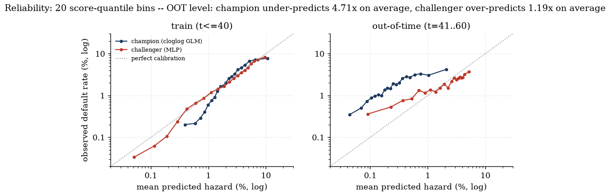
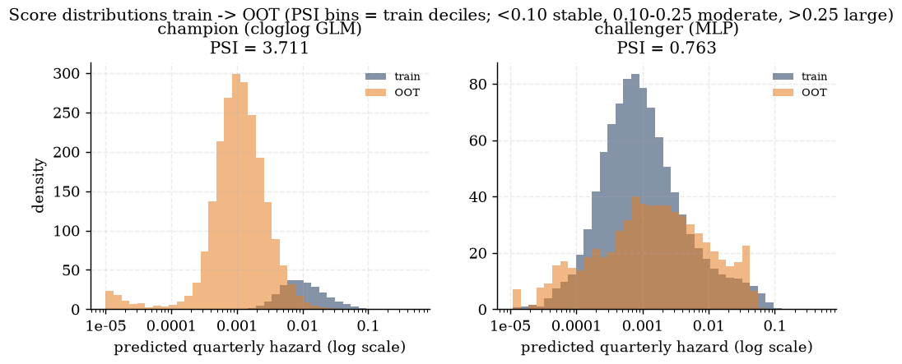
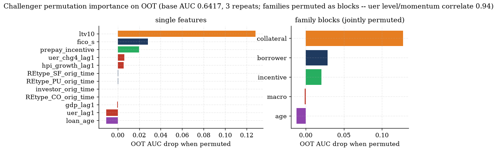
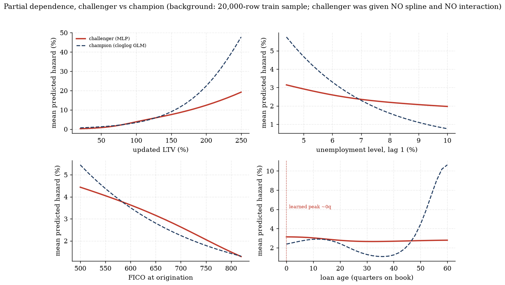
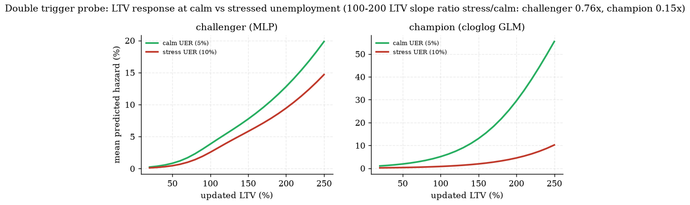
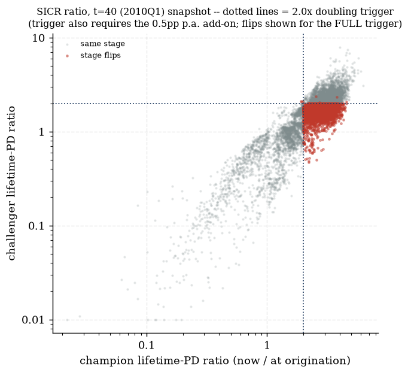

# Champion-challenger scorecard -- MLP hazard PD model

**CHALLENGER, NEVER CHAMPION** (plan section 5). The frozen Day-2 engine remains the sole source of production PDs; this scorecard documents what a flexible learner finds in the SAME data. Like-for-like by construction: identical loan-quarter at-risk rows, identical one-quarter-ahead default_event target, identical covariate information set and timing convention (all macro regressors lagged), no extra features. The MLP received NO age spline and NO hand-built LTV x unemployment interaction.

## Model

| | champion | challenger |
|---|---|---|
| form | cloglog GLM, cr(age, df=5) spline, centered LTVxUER interaction | MLP (64, 32), ReLU, dropout 0.2, AdamW weight decay 0.0001 |
| class imbalance | none needed (GLM likelihood) | pos_weight BCE + prior correction (pos_weight = 35.9) |
| early stopping | n/a (IRLS convergence) | by TIME: fit t<=32, validate t=33..40 (2008Q2..2010Q1), best epoch 8 (val AUC 0.6458), then refit on full train for 8 epochs |
| standardisation | n/a | z-score of continuous features, fitted on train only (times 6..40) |
| backend | statsmodels IRLS | torch on cuda, seed 0, deterministic algorithms = True |

## Discrimination (one-quarter-ahead default AUC)

| model | train (t<=40) | OOT (t=41..60) |
|---|---|---|
| champion | 0.7476 | 0.6609 |
| challenger | 0.7632 | 0.6417 |
| delta (challenger - champion) | +0.0156 | -0.0191 |

## Calibration and stability

Reliability (score-quantile bins, log-log): OOT level: champion under-predicts 4.71x on average, challenger over-predicts 1.19x on average (models trained through 2008-2010Q1 stress score the 2010-2015 recovery -- any shared level gap is the macro regime shift, not an MLP artefact). Challenger predictions are prior-corrected (sigmoid(z - ln pos_weight)) so the class weighting does not inflate the hazard scale.

| PSI train -> OOT (bins = train score deciles) | value | reading |
|---|---|---|
| champion | 3.711 | large shift |
| challenger | 0.763 | large shift |

PSI context: these are POINT-IN-TIME scores whose inputs include lagged macro and HPI-indexed LTV, and the train window ends at the unemployment peak (t=40, 2010Q1) while OOT is the recovery -- a large train->OOT PSI here measures the CYCLE moving through the scores, which a PIT model is SUPPOSED to do, on top of any model instability. The champion's much larger PSI reflects its stronger macro response (its stress-quarter score mass has nowhere to go in the recovery), echoing the wiki's composition-vs-cycle caution -- it is not by itself evidence of a defect in either model.

## What drives the challenger (permutation importance, OOT)

Base OOT AUC 0.6417; drop when permuted, mean of 3 repeats; families permuted as joint blocks (uer level/momentum correlate at 0.94 -- single-feature permutation splits that signal).

| family block | OOT AUC drop |
|---|---|
| collateral | +0.1279 |
| borrower | +0.0286 |
| incentive | +0.0208 |
| macro | -0.0015 |
| age | -0.0120 |

| top single features | family | OOT AUC drop |
|---|---|---|
| ltv10 | collateral | +0.1283 |
| fico_s | borrower | +0.0281 |
| prepay_incentive | incentive | +0.0200 |
| uer_chg4_lag1 | macro | +0.0061 |
| hpi_growth_lag1 | macro | +0.0057 |
| REtype_SF_orig_time | borrower | +0.0004 |
| REtype_PU_orig_time | borrower | +0.0004 |
| investor_orig_time | borrower | +0.0002 |

Dominant families: **collateral, borrower**. Note the collateral family IS a macro channel in disguise: updated_ltv is the HPI-indexed collateral LTV, so the house-price cycle enters the challenger through the loan-level state variable rather than through the lagged macro aggregates -- the near-zero drop for the [macro] block means the AGGREGATE regressors add little ON TOP of the indexed LTV, not that the challenger ignores the cycle.

## Learned shape vs specified shape (PDPs)

* **Seasoning hump: DOES NOT REAPPEAR** -- the challenger's loan_age partial dependence peaks at 0 quarters on book with no spline supplied (champion's specified spline peaks at 12q, empirical at 10q). Consistent with the [age] permutation drop of -0.0120 OOT: the challenger barely uses age, and its age shape is unstable across training configurations -- the spline prior the champion carries is doing real work.
* **Double trigger**: LTV slope (100-200 LTV band) at 10% vs 5% unemployment -- challenger 0.76x, champion 0.15x. The champion's own fitted interaction was slightly NEGATIVE in-sample (slope flattens under stress; outputs/hazard/fit_stats.md), so the honest question is whether the challenger agrees with that in-sample substitution pattern, not whether it manufactures steepening.
* uer_lag1 PDP moves the LEVEL holding 4q momentum fixed -- same decomposition caveat as the champion's uer_lag1 coefficient.

## Staging impact (t=40 snapshot, 2010Q1)

Challenger default PDs swapped into the frozen SICR machinery (lifetime-PD doubling trigger + 0.5pp p.a. add-on; engine/staging.py, read-only). Champion PREPAYMENT hazard kept in the competing-risk survival on both sides -- the deltas isolate the default-PD model. Memoryless quantitative trigger at the snapshot (probation and the structurally inert 30-DPD backstop are identical machinery on both sides). Stage 3 is definitionally identical.

| | count (of 13,413 live loans) |
|---|---|
| Stage 2 -- champion | 10,503 (78.3%) |
| Stage 2 -- challenger | 3,595 (26.8%) |
| Stage 2 under both | 3,592 |
| champion-only (challenger DE-stages to Stage 1) | 6,911 |
| challenger-only (challenger PROMOTES to Stage 2) | 3 |
| net challenger effect | -6,908 loans (-51.5pp of the live book) |

Direction: the challenger DE-STAGES on net. Its now-vs-origination lifetime-PD ratios are compressed toward 1 relative to the champion's (flatter macro response plus the level-off age tail damp both legs of the relative test), so the doubling trigger fires far less often at the stress snapshot. This is a functional-form finding about the RELATIVE test, not an allowance restatement -- production staging stays with the frozen champion engine.

## Documented simplifications / caveats

* Challenger lifetime PDs clamp loan_age at the training support (max 80q; level-off tail, the plan's accepted default). The champion extrapolates its natural spline linearly. An MLP has no disciplined tail -- one reason it stays challenger.
* Early stopping consumes the t=33..40 window for validation; the final model is REFIT on the full training window for the early-stopped epoch count to restore data parity with the champion.
* Staging swap compares the memoryless quantitative trigger at the snapshot (no probation window, no backstop -- both identical machinery on both sides and inert/orthogonal to the PD swap).
* Determinism: bitwise-reproducible on the same device/build (fixed seeds, deterministic algorithms, CUBLAS workspace pinned); results differ across CPU vs GPU and torch/CUDA versions.
* Frozen-covariate projections on both lifetime-PD legs (rung-1 tail assumption inherited from the engine).