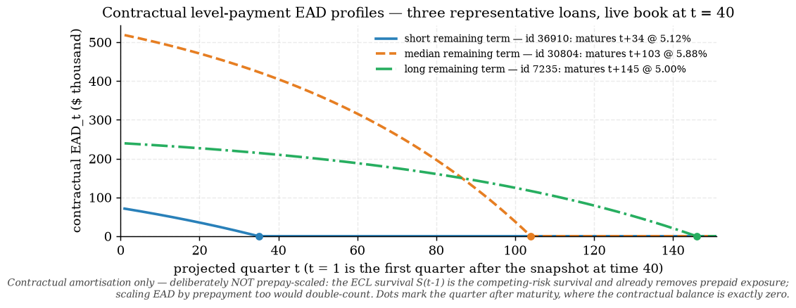

# EAD exhibits — contractual exposure profiles (engine/ead.py)

Snapshot: live book at t = 40 (last training quarter; terminal rows and zero balances excluded) — **13,413 loans**, total balance $3.52bn, median note rate 6.50%, median remaining term 103 quarters. Projection horizon 189 quarters (covers every loan's maturity plus one quarter).

## Conventions (engine/ead.py docstring is binding)

* **EAD_t = contractual balance entering period t** (after t-1 scheduled payments), matching the compute_ecl §3 golden fixture; EAD_1 = snapshot balance.
* Level-payment (annuity) amortisation, quarterly compounding of the nominal annual note rate in percent: r_q = rate/400.
* Rate <= 0 / missing -> straight-line fallback (defensive only: every panel row has interest_rate_time > 0).
* Remaining term = mat_time - time, floored at 1 quarter.
* **CRITICAL — no prepayment double counting**: the path is CONTRACTUAL, never prepay-scaled. The ECL survival S(t) = prod(1 - lambda_default - lambda_prepay) from engine/hazard.py already carries prepayment; scaling EAD as well would double-count and understate lifetime ECL.
* Revolver capability (no revolvers in the DCR book): EAD = drawn + CCF x max(limit - drawn, 0); reproduces the §12 fixture 5 + 0.6 x 15 = **14.0m** (asserted in tests/test_ead.py).

## Representative loans (deterministic 2nd/50th/98th remaining-term percentiles)

| profile | id | balance $ | note rate % | remaining quarters | loan age (q) |
|---|---|---|---|---|---|
| short remaining term | 36910 | 71,055 | 5.12 | 34 | 26 |
| median remaining term | 30804 | 518,230 | 5.88 | 103 | 18 |
| long remaining term | 7235 | 239,319 | 5.00 | 145 | 16 |

## Full-book sanity checks (all loans in the snapshot)

| check | metric | criterion | result |
|---|---|---|---|
| EAD_1 equals snapshot balance | 0.000e+00 | max abs diff == 0 | PASS |
| monotone non-increasing path | 0.000e+00 | max one-step increase <= float noise | PASS |
| terminal balance 0 past maturity | 0.000e+00 | max |EAD_{rem+1}| == 0 | PASS |
| EAD_t <= balance * (1 + one quarter's interest) | 1.000e+00 | max path/balance ratio <= 1 + r_q | PASS |
| (stricter) EAD_t <= snapshot balance | 0.000e+00 | max excess over balance <= 0 | PASS |

## Documented simplifications

* Original contractual maturity only — no modification / payment-holiday reprofiling data exists in the panel.
* Every term loan treated as level-pay to zero; no balloon or interest-only structures (no amortisation-type field in the DCR data — disciplined default for US fixed-rate mortgages).
* Fixed note rate over the projection (interest_rate_time frozen at the snapshot; ARM resets out of scope at this rung).
* Loans at/past maturity (remaining term floored at 1) are due in full within one quarter.
